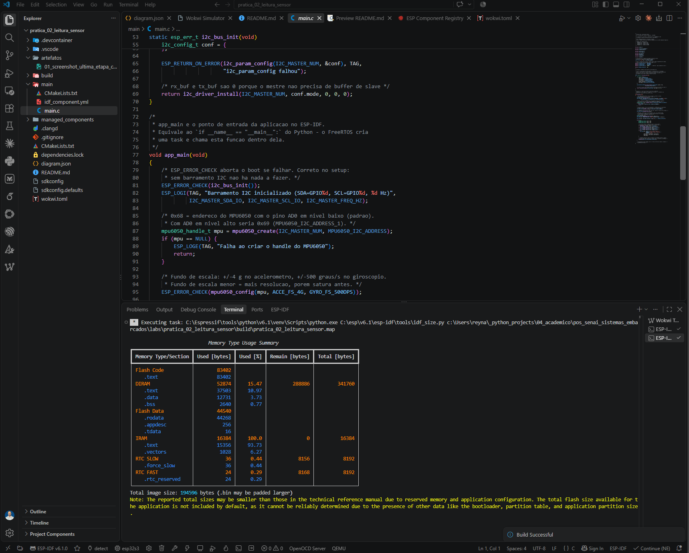
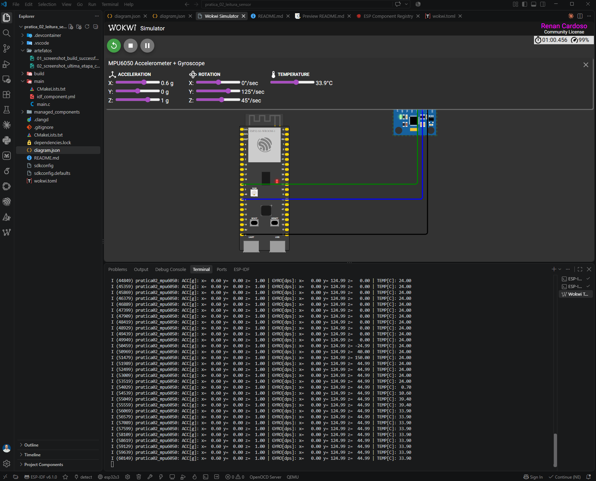

# Prática 2/6 — Leitura de sensor (MPU6050 via I2C)

- **UC:** IA Embarcada e Modelos Compactos — Pós-graduação em Inteligência Artificial Aplicada, UniSENAI
- **Prof.:** MSc. Rodrigo Kobashikawa Rosa
- **Aluno:** Renan Cardoso

---

## O desafio

> Desenvolver uma aplicação embarcada completa que leia dados de um sensor simulado no Wokwi e exiba os resultados no monitor serial, utilizando o ESP-IDF dentro do VS Code.

### Requisitos e como foram atendidos

| # | Requisito do enunciado | Como foi atendido neste projeto | Status |
|---|---|---|---|
| 1 | Configurar o ESP-IDF e a conta Wokwi | ESP-IDF v6.1 instalado via EIM; extensão Wokwi licenciada no VS Code | ✅ screenshot |
| 2 | Escolher um sensor disponível no Wokwi (DHT11, BMP180 ou **MPU6050**) | **MPU6050** — acelerômetro + giroscópio + temperatura, via I2C | ✅ |
| 3 | Montar o circuito conectando o sensor ao ESP32-S3, respeitando alimentação, GND e dados | `diagram.json`: VCC→3V3, GND→GND, SDA→GPIO8, SCL→GPIO9 | ✅ |
| 4 | Inicializar o sensor conforme a documentação da biblioteca escolhida | Biblioteca oficial `espressif/mpu6050` v1.2.1 do ESP Component Registry; sequência `create` → `config` → `wake_up` → `get_deviceid` | ✅ |
| 5 | Implementar o código em C | [`main/main.c`](main/main.c) — ESP-IDF puro, `app_main`, `ESP_LOGI`, `vTaskDelay` | ✅ |
| 6 | Executar a simulação no VS Code com a extensão Wokwi e capturar o monitor serial | Simulação executada; leituras conferem com o painel do sensor — ver [Evidências](#evidências) | ✅ screenshot |


### Entrega

- [x] Link do repositório Git com o código desenvolvido
- [x] Screenshot — ESP-IDF e conta Wokwi configurados
- [x] Screenshot — circuito montado corretamente no Wokwi
- [x] Screenshot — código compilando sem erros (`Project build complete`)
- [x] Screenshot — monitor serial mostrando as leituras do sensor

---

## A solução

Aplicação embarcada que lê **aceleração, giroscópio e temperatura** de um MPU6050 pelo barramento I2C e imprime os valores no monitor serial a cada 500 ms.

| Item | Escolha |
|---|---|
| Placa | ESP32-S3-DevKitC-1 (simulada no Wokwi) |
| Framework | ESP-IDF v6.1 |
| Linguagem | C |
| Sensor | MPU6050 — acelerômetro + giroscópio, I2C |
| Biblioteca | `espressif/mpu6050` v1.2.1 (ESP Component Registry) |

### Circuito

| MPU6050 | ESP32-S3 | Fio |
|---|---|---|
| VCC | 3V3 | vermelho |
| GND | GND | preto |
| SDA | GPIO8 | verde |
| SCL | GPIO9 | azul |

Endereço I2C: **0x68** (pino AD0 em nível baixo — o padrão). Com AD0 em nível alto seria 0x69.

O `diagram.json` também liga `esp:TX → $serialMonitor:RX` e `esp:RX → $serialMonitor:TX`. Sem essas duas conexões a simulação roda, mas o terminal fica mudo.

---

## Como rodar

Ative o ambiente ESP-IDF (PowerShell, instalação via EIM):

```bash
. 'C:\Espressif\tools\Microsoft.v6.1.PowerShell_profile.ps1'
```

Depois, na raiz deste projeto:

```bash
idf.py build
```

E então, no VS Code: `Ctrl+Shift+P` → **`Wokwi: Start Simulation`**.

> **Sem build, não há simulação.** O Wokwi executa o `.elf` gerado pelo ESP-IDF — toda alteração em C exige novo build antes de reiniciar a simulação. Alteração apenas no `diagram.json` não exige rebuild.

---

## Saída esperada no monitor serial

```
I (xxx) pratica02_mpu6050: Barramento I2C inicializado (SDA=GPIO8, SCL=GPIO9, 100000 Hz)
I (xxx) pratica02_mpu6050: MPU6050 WHO_AM_I: 0x68 (esperado: 0x68)
I (xxx) pratica02_mpu6050: Iniciando leituras a cada 500 ms...
I (xxx) pratica02_mpu6050: ACC[g]: x=  0.00 y=  0.00 z=  1.00 | GYRO[dps]: x=   0.00 y=   0.00 z=   0.00 | TEMP[C]: 25.00
```

O `WHO_AM_I` respondendo **0x68** é a prova de que barramento, endereço e fiação estão corretos — é o primeiro teste a fazer em qualquer sensor I2C.

Em repouso, o eixo Z marca ≈ **1.00 g**: é a gravidade. Arraste o sensor no painel do Wokwi durante a simulação e os valores mudam.

---

## Estrutura

```
pratica_02_leitura_sensor/
├── CMakeLists.txt          # project() + correção de compatibilidade mpu6050 x IDF 6.1
├── sdkconfig.defaults      # config versionada (sdkconfig NÃO vai pro Git)
├── dependencies.lock       # versões exatas resolvidas — versionado
├── diagram.json            # circuito do Wokwi
├── wokwi.toml              # aponta para o .elf do build
├── main/
│   ├── main.c              # aplicação: I2C + MPU6050 + logs
│   ├── CMakeLists.txt      # REQUIRES driver
│   └── idf_component.yml   # dependência espressif/mpu6050
└── artefatos/              # screenshots que comprovam a entrega
    ├── 01_screenshot_build_successful.png
    └── 02_screenshot_ultima_etapa_circuito_funcionando.png
```
---

## Evidências

### 1. ESP-IDF configurado, código em C e build sem erros



Comprova três critérios de uma vez:

- **ESP-IDF configurado** — a barra de status inferior mostra `ESP-IDF v6.1.0` e o target `esp32s3`
- **Código implementado em C** — `main/main.c` aberto no editor, com a inicialização do barramento I2C e a criação do handle do MPU6050
- **Build sem erros** — notificação **`Build Successful`** e o relatório de memória do `idf.py size` no terminal (`Total image size: 194596 bytes`)

### 2. Circuito montado, simulação rodando e monitor serial com as leituras



Esta é a **última etapa finalizada**. Comprova:

- **Conta Wokwi ativa** — licença `Renan Cardoso — Community License` no canto superior direito
- **Circuito montado** — ESP32-S3-WROOM-1 e MPU6050 ligados pelos quatro fios (3V3, GND, SDA/GPIO8, SCL/GPIO9)
- **Sensor iniciado e lido corretamente** — o painel do MPU6050 e o monitor serial batem valor a valor

A correspondência entre o painel do simulador e o log é a prova de que a leitura é real, e não um valor fixo impresso no código:

| Grandeza | Painel do Wokwi | Monitor serial |
|---|---|---|
| Aceleração X | 0,6 g | `x= 0.60` |
| Aceleração Z | 1 g | `z= 1.00` |
| Rotação Y | 125 °/s | `y= 124.99` |
| Rotação Z | 45 °/s | `z= 44.99` |
| Temperatura | 33,9 °C | `TEMP[C]: 33.90` |

No log dá para ver a temperatura acompanhando o slider em tempo real (`24.00` → `0.70` → `10.60` → `39.40` → `33.90`), o que descarta leitura em cache.
